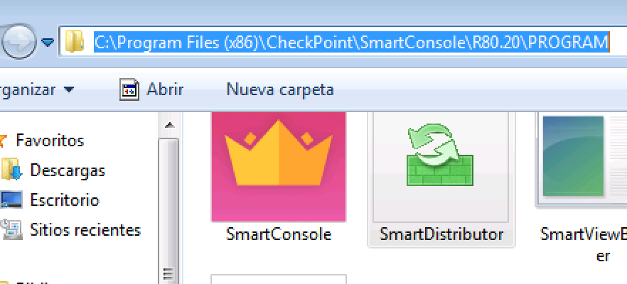
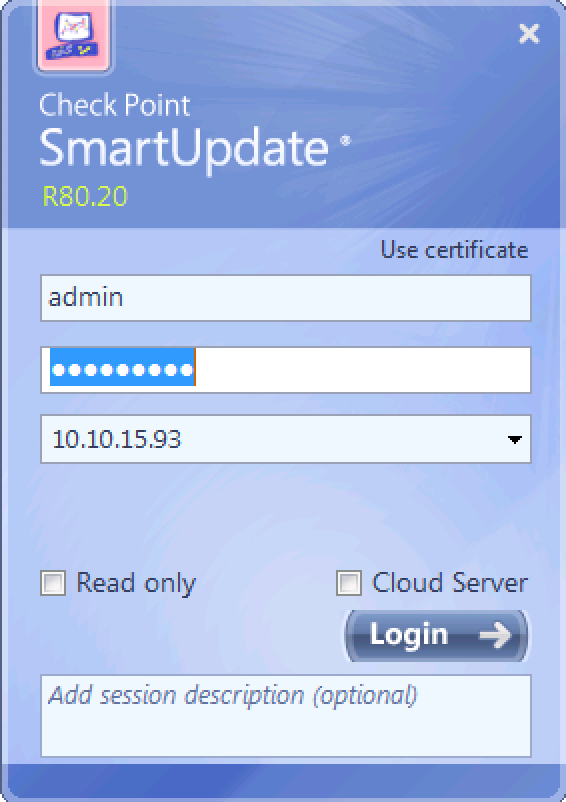
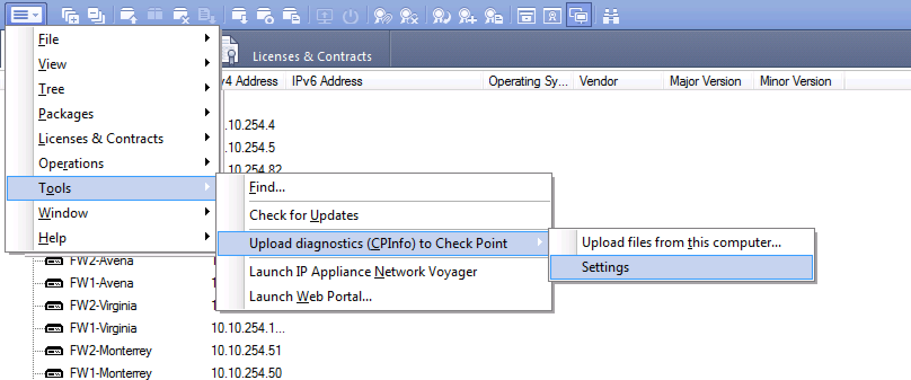
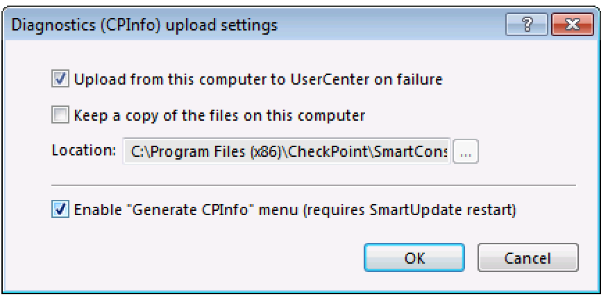
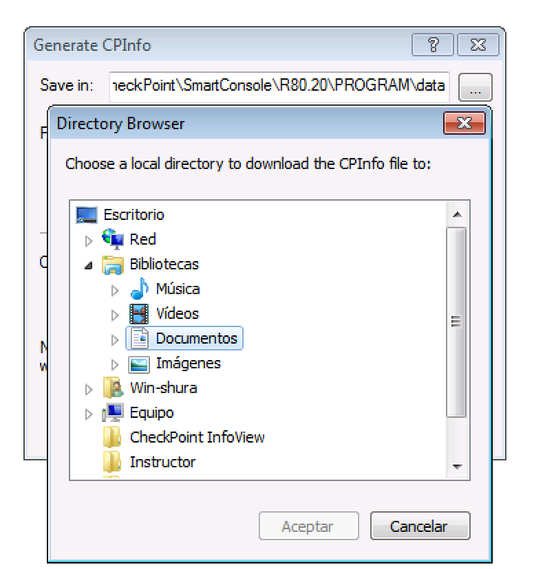
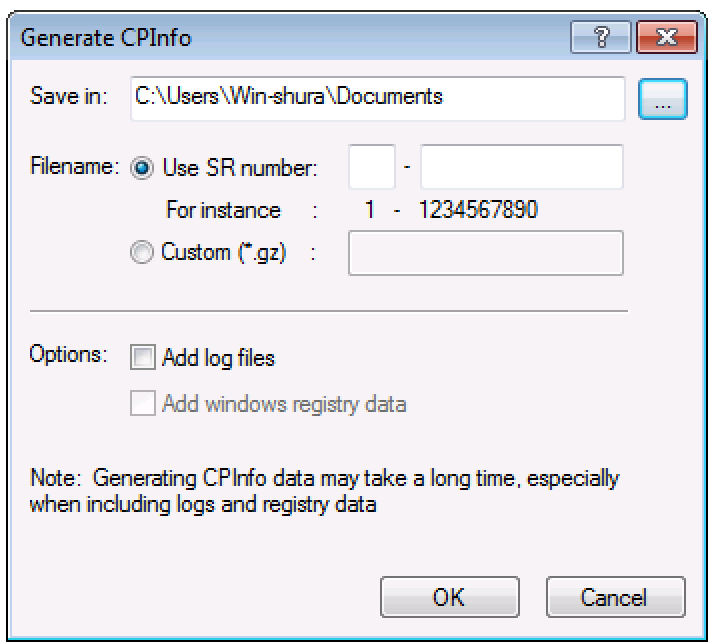

# Obtener archivos CPinfo de FW Checkpoint 

## Para poder tener el reporte completo se necesita obtener el CPInfo de cada Security Gateway que forman la solucion de seguridad del cliente, por ejemplo, si se tienen dos cluster, se debe sacar el CPInfo de cada miembro de los diferentes cluster.

En este apartado se muestra como obtener los archivos CPinfo desde la consola de SmartUpdate. 

1.- Abrir la aplicacion SmartUpdate, en caso de no encontrar el acceso directo en el menu de inicio, la aplicacion se encuentra en la carpeta donde esta instalado el Smartconsole, en la version R80.20 se encuentra en la siguiente carpeta "C:\Program Files (x86)\CheckPoint\SmartConsole\R80.20\PROGRAM" 

   

2.- Conectarse al Security Management Server por medio del SmartUpdate. 

Abrir la aplicacion tiene el nombre "SmartDistributor.exe"
Colocar 
admin
contraseña 
IP

   

3.- Validar que la opcion "Generatet CPInfo" este habilitado, en caso de estar habilitado ir al paso 7

4.- Ir al menu Tools>Upload diagnostics (CpInfo) to Check Point>Setting

   

5.- Habilitar la opcion "Enable "Generate CPInfo" menu (requires SmartUpdate restart)".

   

6.- Dar click en "OK" y reiniciar la aplicacion SmartUpdate.

7.- Seleccionar el Security Gateway del que se desee obtener el archivo de CPInfo. 

8.- Dar click con el boton derecho. 

9.- Seleccionar la opcion "Generate CPInfo..."

   

10.- Se mostrara una ventana con las opciones para generar el archivo. 

   

11.- Seleccionar una carpeta en donde se guardara el archivo a crear en la opcion "Save In".

   

12.- Dar click en "OK" para generar el archivo. 

   

13.- Subir el archivo creardo a su respectiva carpeta en el Drive 

https://drive.google.com/drive/folders/19tf1YE8uF1r91yXx-XJ5c0h4sBjKSIpS?usp=sharing
